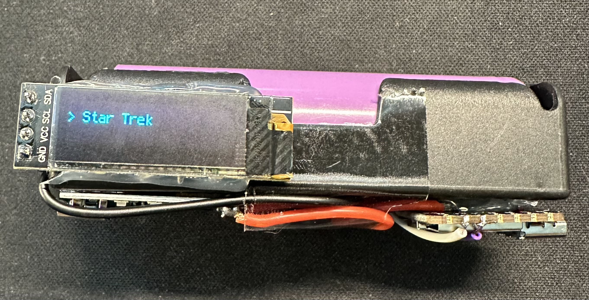
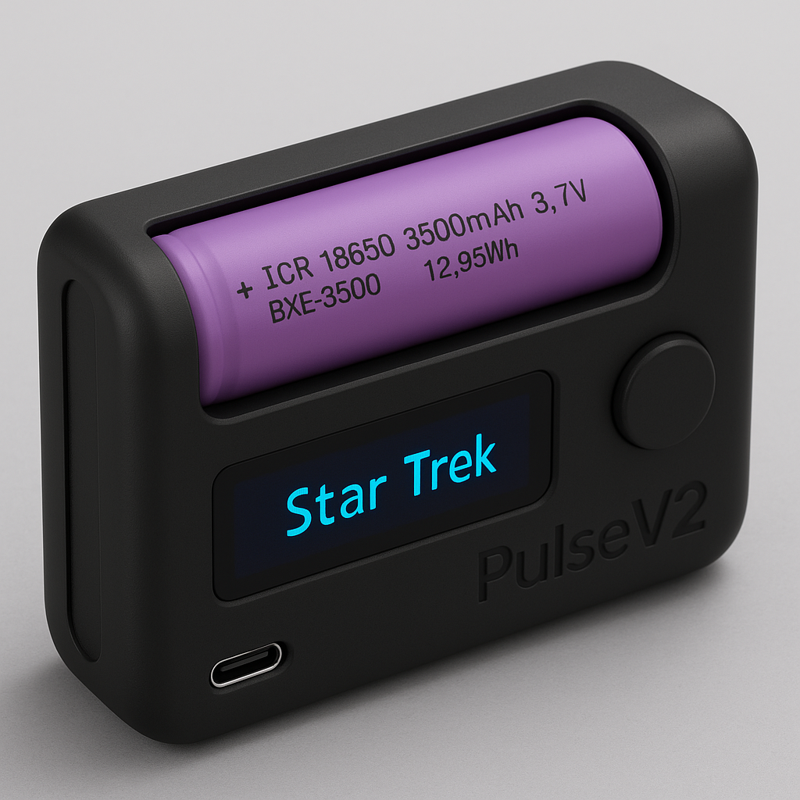

# PulseV1

**PulseV1** is a compact, 18650-powered, CircuitPython-based multifunction gadget. Designed for portability and versatility, it features music playback, lighting modes, meditation guidance, timers, and an interactive OLED interface all controlled by a single button. Ideal for learning, tinkering, or just carrying a little tech fun in your pocket.

---

## ⚡ Key Features

- 🧠 **Single-Button Menu Interface**  
  Navigate a list of features using short and long presses.

- 🖥️ **OLED Display (128x32)**  
  Shows menu items, timers, and animation text.

- 🌈 **NeoPixel RGB LED**  
  Used for mood lighting, strobe, and breathing effects.

- 🔊 **Piezo Buzzer (D10)**  
  Plays sound effects and melodies like the Star Trek theme.

- 🔋 **Powered by 18650 Li-ion Battery**  
  Rechargeable and portable, built into the design.

- 🔌 **TP4056 Charging Module with Dual MOSFET Protection**  
  Enables safe USB charging and output at the same time without risk of back-charging the USB source.

---

## 🧰 Hardware List

| Component                | Description                                     |
|--------------------------|-------------------------------------------------|
| MCU Board                | Seeed Studio XIAO or RP2040-compatible          |
| OLED Display             | SSD1306 128x32 I2C                              |
| Buzzer                   | Piezo (connected to D10)                        |
| Button                   | Digital input (connected to D9)                |
| Battery                  | 18650 Lithium-Ion cell                          |
| Charging Module          | TP4056 w/ protection                            |
| Optional Power Switch    | For toggling the whole unit                    |

---

## 🧠 Modes & Functions

- **🎵 Star Trek Theme** – Plays a melody using the piezo buzzer.
- **🌈 Rainbow LED** – Cycles through a full RGB spectrum.
- **⏱️ Timer** – Choose from 10s, 30s, or 60s countdowns with visual/audible feedback.
- **🧘 Meditation** – Breathing guide with visuals and tones.
- **🎞️ Animation** – Frame-based light/text animation.
- **🔦 Flashlight** – Full-bright white LED mode.
- **⚡ Strobe** – Rapid blinking white LED.
- **😴 Sleep Mode** – OLED off, lights off, waits for button press to reawaken.

---

## 🧪 Usage Instructions

1. **Power On** – Toggle switch if present.
2. **Cycle Menu** – Tap the button to scroll through available modes.
3. **Select Mode** – Hold the button for ~1 second to activate.
4. **Exit Mode** – Hold button in most modes for ~1.5–2 seconds to return.

---

## 🔌 Power & Charging

- The TP4056 module with protection IC safely charges the 18650 cell via micro-USB.
- Two external MOSFETs are added to **prevent back-charging the USB source** while allowing the device to run off the battery.
- System is designed to run continuously while charging, making it ideal for stationary or portable use.

---

## 🚀 PulseV2 Concept

While PulseV1 proves what’s possible in a tiny form factor, **PulseV2** envisions a leap forward in smart, modular, and wireless functionality. It will expand the project’s potential beyond a single device into a customizable platform.

### 🔧 Planned Enhancements

- **📱 Bluetooth LE or Wi-Fi**  
  Wireless control via a mobile app or other smart devices, supporting remote commands, real-time status display, or live updates.

- **📦 Modular Expansion Ports**  
  Add support for additional plug-in modules: sensors, GPS, or haptic feedback add-ons.

- **📈 Battery Fuel Gauge**  
  Add dedicated circuitry to monitor exact battery percentage and health metrics.

- **🧭 Multi-Button or Capacitive Touch**  
  More input methods for quicker navigation and advanced UI interaction.

- **🧏‍♂️ Sound Input & Response**  
  Microphone for detecting sound events or enabling voice/ambient interaction.

- **🌐 Cloud Sync / IoT**  
  Sync data like timers or meditation sessions to cloud dashboards.

---

Stay tuned as PulseV2 development kicks off! Community suggestions are welcome as this next-gen tool evolves from concept to prototype.
