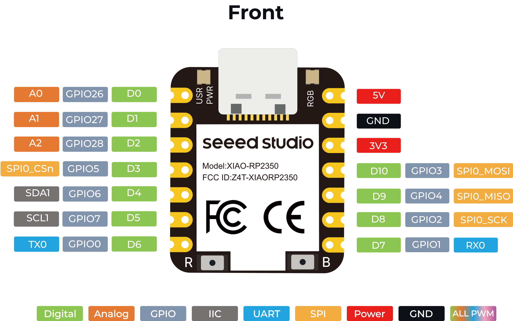

# Seeed Studio XIAO RP2350 — CircuitPython Projects & Reference

Welcome to my project repo for the **Seeed Studio XIAO RP2350**, a thumb-sized but powerful MCU board built around the Raspberry Pi RP2350 chip. This repo contains **CircuitPython-based** demos, documentation, and projects I use for prototyping and experimentation.

---

## ⚙️ Why CircuitPython?

Although the XIAO RP2350 supports C/C++ and MicroPython, this repo focuses on **CircuitPython** due to:

- Rapid prototyping
- Built-in libraries for I2C, PWM, Display, Audio, etc.
- Easy USB drag-and-drop `.py` development
- Seamless integration with sensors and peripherals

> This board is ideal for quick CircuitPython projects using sensors, RGB control, displays, and low-power logic — all in a compact footprint.

---

## ✅ Board Features (XIAO RP2350)

- **MCU**: Raspberry Pi RP2350, Dual Arm Cortex-M33 @ 150MHz with FPU
- **Security**: Secure boot & encrypted bootloader
- **Memory**: 520kB SRAM + 2MB Flash
- **Onboard Peripherals**:
  - RGB LED
  - 19 multifunction GPIOs (Analog, Digital, I²C, UART, SPI, PWM)
  - 8 extra IO pins on the back
- **Power**:
  - Ultra-low sleep current (~27μA)
  - Battery voltage readable via internal IO
- **Form Factor**: Just 21 × 17.8 mm, SMD-friendly stamp holes

---

## 📁 Repo Structure

| Folder/File | Description |
|-------------|-------------|
| `images-gifs/` | Photos and diagrams of the board |
| `docs/`     | Reference materials, pinout diagrams |
| `Projects/` | Larger themed builds using CircuitPython |
| `README.md` | This file |

---

## 🛠 Getting Started with CircuitPython

1. **Install CircuitPython**  
   Go to [https://circuitpython.org/board/xiao_rp2350/](https://circuitpython.org/board/seeeduino_xiao_rp2350/) and download the latest `.uf2` firmware.

2. **Flash the Board**
   - Hold the **BOOT** button while connecting via USB.
   - Drag the `.uf2` to the mounted volume (e.g. `RPI-RP2`)
   - It will remount as `CIRCUITPY`

3. **Edit Code**
   - Open the `code.py` file on `CIRCUITPY`
   - Write your CircuitPython logic
   - Save to run instantly!

4. **Install Libraries**
   - Download the [Adafruit CircuitPython Bundle](https://circuitpython.org/libraries)
   - Copy only needed `.mpy` files or folders into the `lib/` folder on the board

---

## 🧪 Live Testing Setup

This board is small but mighty. Ideal for:

- Prototyping wearables
- Teaching embedded development
- Battery-powered automation
- Low-power data logging

---

## 📎 Links

- [Seeed XIAO RP2350 Wiki](https://wiki.seeedstudio.com/getting-started-xiao-rp2350/)
- [CircuitPython Official Website](https://circuitpython.org/)
- [Adafruit Library Reference](https://docs.circuitpython.org/projects/)
- [RP2350 Datasheet/ Schm.](https://wiki.seeedstudio.com/getting-started-xiao-rp2350/#assets--resources)

---

## 📝 License

MIT License — open to sharing and contributions.
